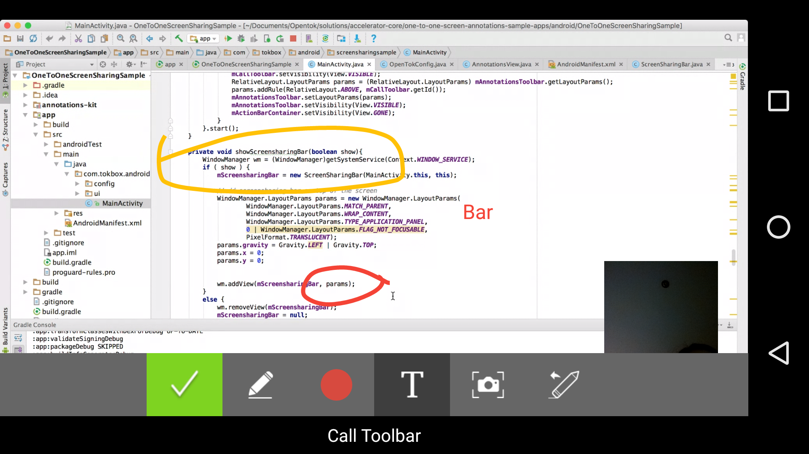

[](https://travis-ci.com/opentok/accelerator-annotation-android)

# OpenTok Accelerator Annotations for Android<br/>Version 2.0.0

## Quick start

This section shows you how to use the OpenTok Accelerator Annotations.

## Add the Annotations library

  - [Using the repository](#using-the-repository)
  - [Using Maven](#using-maven)


### Using the repository

1. Clone the [OpenTok Accelerator Annotations repo](https://github.com/opentok/accelerator-annotations-android).
2. Start Android Studio and create a new project.
4. From the project view, right-click the app name and select **New > Module > Import Gradle Project**.
5. Navigate to the directory in which you cloned **OpenTok Accelerator Annotation**, select **accelerator-annotation-android**, and click **Finish**.
6. Open the **build.gradle** file for the app and ensure the following lines have been added to the `dependencies` section:
```
   compile project(‘:accelerator-annotation-android')
```

#### Using Maven

<ol>

<li>Modify the <b>build.gradle</b> for your solution and add the following code snippet to the section labeled 'repositories’:

<code>
maven { url  "http://tokbox.bintray.com/maven" }
</code>

</li>

<li>Modify the <b>build.gradle</b> for your activity and add the following code snippet to the section labeled 'dependencies’:

<code>
compile 'com.opentok.android:opentok-accelerator-textchat:2.1.0'
</code>

</li>

</ol>

## Exploring the code

For detail about the APIs used to develop this accelerator pack, see the [OpenTok Android SDK Reference](https://tokbox.com/developer/sdks/android/reference/) and [Android API Reference](http://developer.android.com/reference/packages.html).

_**NOTE:** The project contains logic used for logging. This is used to submit anonymous usage data for internal TokBox purposes only. We request that you do not modify or remove any logging code in your use of this accelerator pack._

### Class design

| Class        | Description  |
| ------------- | ------------- |
| `AnnotationsToolbar`   | Provides the initializers and methods for the annotation toolbar view, and initializes functionality such as text annotations, a screen capture button, an erase button that removes the last annotation that was added, a color selector for drawing strokes and text annotations, and controls scrolling. You can customize this toolbar. |
| `AnnotationsView`   | Provides the rectangular area on the screen which is responsible for drawing annotations and event handling. |
| `AnnotationsListener`   | Monitors state changes in the Annotations component. For example, a new event would occur when a screen capture is ready or there is an error. |
| `AnnotationsPath`   | Extends the [Android Path class](https://developer.android.com/reference/android/graphics/Path.html), and defines the various geometric paths to be drawn in the `AnnotationView` canvas. |
| `AnnotationText`   | Defines the text labels to be drawn in the `AnnotationViewCanvas`. |
| `Annotatable`   | Each `AnnotationText` or `AnnotationPath` is defined as an annotatable object. |
| `AnnotationsManager`   | Manages the set of the annotations in the annotations view. |
| `AnnotationsVideoRenderer`   | Extends the [BaseVideoRenderer](https://tokbox.com/developer/sdks/android/reference/com/opentok/android/BaseVideoRenderer.html) class in the OpenTok Android SDK, and includes screenshot functionality. |

**NOTE:** Scrolling is frozen while the user adds annotations. Scrolling is re-enabled after the user clicks **Done**, and the annotations are removed at that point.


### Using the Accelerator Annotation

#### Add the annotation toolbar

Add the `AnnotationsToolbar` to your layout:</p>

```java
<com.tokbox.android.annotations.AnnotationsToolbar
    android:id="@+id/annotations_bar"
    android:layout_width="match_parent"
    android:layout_height="wrap_content"
    android:layout_gravity="bottom"/>
```

The `AnnotationsToolbar` offers the following actions:
  - _Freehand Annotation_: Handwritten annotation
  - _Text Annotation_: Text label annotations.
  - _Color Picker_: Select a color for the annotation.
  - _Erase_: Delete the most recent annotation.
  - _Screen Capture_: Take a screenshot of the annotations.
  - _Done_: Clear all annotations and re-enabling scrolling.


#### Add a custom annotation renderer

If you would like to create a new instance of the `AnnotationsVideoRenderer` class or a new custom video renderer, start with this line of code:

```java
AnnotationsVideoRenderer mRenderer = new AnnotationsVideoRenderer(this);
mScreenPublisher.setRenderer(mRenderer);
```


#### Attach the annotation canvas to a view

You can attach an annotation canvas to a publisher or subscriber view:

```java
try {
  AnnotationsView annotationsView = new AnnotationsView(this, sdkWrapper, OpenTokConfig.API_KEY, mComm.getRemote());
  annotationsView.attachToolbar(mAnnotationsToolbar);
  previewContainer.addView(annotationsView);

} catch (Exception e) {
  Log.i(LOG_TAG, "Exception - add annotations view " + e);
}
```

#### Implement an annotations listener class

To listen for annotation events, implement an `AnnotationsListener`:

```java
public  interface AnnotationsListener {
  void onScreencaptureReady(Bitmap bmp);
  void onAnnotationsSelected(AnnotationsView.Mode mode);
  void onAnnotationsDone();
  void onError(String error);
}
```

```java
public class MainActivity
    extends AppCompatActivity
    implements AnnotationsView.AnnotationsListener {

    @Override
    public void onScreencaptureReady(Bitmap bmp) {
        //A new screencapture is ready
    }

    @Override
    public void onAnnotationsSelected(AnnotationsView.Mode mode) {
        //An annotations item in the toolbar is selected
    }

    @Override
    public void onAnnotationsDone() {
        //The DONE button annotations item in the toolbar is selected. Scrolling is re-enabled.
    }

    @Override
    public void onError(String error) {
       //An error happens in the annotations
    }
  ...
}
```

### One to one sample app using the Accelerator Annotation with best-practices for Android (https://github.com/opentok/one-to-one-screen-annotations-sample-apps).


